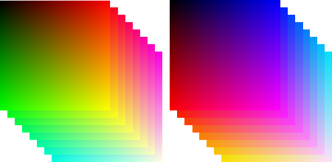

# xyz2zxy

Convert XY-cross sectional images to ZX-cross sectional images.




## Overview
* This program converts 3D images defined by XY corss-sectional images to different cross-sectional images (ZX).
* Such images are easy to convert by reading all images at once, however it requires huge memory size. 
* This program reduces memory usage by  divide-and-conquer approach (or using HDD for temporary data).
* This can be used for observation of very large serial-sectioning images in a different axis-aligned cross-section.

## Requirements
* CMake 
* C++17 or later (filesystem)
* OpenCV ( probabliy >2.0.0. )
* fmt (https://fmt.dev) (v.8.0.1 or later)
## Build and Test 
### Unix-like System with CMake 
```bash
% mkdir build
% cd build
% cmake ..
% make  
% make check #validation
%
```
### Windows (Visual Studio )
* Use CMake to create the solution file.
### Other systems. 
* See CMakeLists.txt
### Usage
* ``xyz2zxy {input_dir} {output_dir} -n {n}``
  * ``input_dir`` : the directory where images are contained.
  * ``output_dir`` : the directory where converted images are saved.
  * ``n`` : the number of images that are lorded in the memory (Default : 100). Larger n computes faster, but requires large memory size.
*  ``make_sample, validate`` : executables for validation.
##License 
* MIT License
##Developper
* Takashi Michikawa <ram-axed-0b@icloud.com>, Image Processing Research Team, RIKEN Center for Advanced Photonics.
##Copyrights 
* Main codes : (c)2021 - now RIKEN
* mi/*.hpp : (c)2007 - now Takashi Michikawa
##Acknowlegments
* This work was supported by Council for Science, Technology and Innovation(CSTI), Cross-ministerial Strategic Innovation Promotion Program (SIP), “Materials Integration for revolutionary design system of structural materials”(Funding agency:JST).
